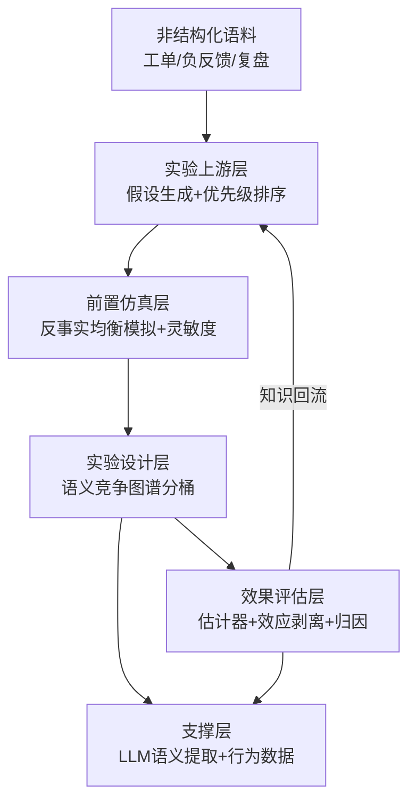

# SemAdExp：LLM 语义增强的双边市场实验智能平台


[English](README_EN.md) | 中文

一个端到端可复现、四层全部量化验证的广告实验智能平台开源项目。核心命题：
**LLM 语义信息贯穿实验全链路（假设生成 → 反事实均衡仿真 → 语义竞争分桶 → 效果估计 → 归因与剥离 → 知识回流），提升双边广告市场实验的准确性、稳定性与迭代效率。**

## 核心证据（当前固定种子运行结果，见 `results/technical_report.md`）

| 挑战 | 方法 | 关键量化证据 |
|---|---|---|
| 特征滞后 | LLM 语义特征 + 行为特征融合 | AUC 0.629 → 0.672（+0.043），熵增益 +0.014 nats |
| 广告主异质性 | 语义竞争图谱群落分桶 | 跨组强竞争边占比 0.525 → 0.255；最严苛场景 bias -2.024 → -0.678，RMSE 2.098 → 0.864 |
| 衡量准确性 | 干扰感知估计 + 效应剥离 | 随机化推断覆盖率 1.0（保守校准）；间接效应均值恢复误差 ≈ 0 |
| 迭代效率 | LLM 假设生成 + 优先级排序 | Top-8 机会召回率 100%，Spearman ρ=+0.800，50% 价值捕获仅需 1 个实验（随机基线 20 个） |
| 试错成本 | 反事实均衡模拟 | 忽略广告主响应时总消耗误估 ±5%、中小广告主存活率误估 +19%，灵敏度带量化风险 |

## 架构



## 快速开始

```bash
# 1. 创建虚拟环境并安装依赖
python -m venv .venv
.venv/bin/pip install -r requirements.txt

# 2. 一键验证（测试 + Notebook 构建 + 快速全流程）
./scripts/verify.sh

# 3. 一键运行全流程（含场景矩阵、知识库、均衡模拟、闭环、报告）
.venv/bin/python -m semadexp.cli run-all --scale full
# 产物：results/technical_report.md、results/matrix_results.csv、results/figures/*

# 快速验证（约 1 分钟）
.venv/bin/python -m semadexp.cli run-all --scale quick --out results_quick

# 4. 运行测试
.venv/bin/python -m pytest
```

## 项目文档

- [项目概览](docs/project_overview.md) —— 定位、问题对应、量化证据、工程亮点
- [15 分钟项目演示指南](docs/demo_guide.md) —— 时间分配与对应 Notebook 路径
- [常见问题 FAQ](docs/faq.md) —— 方法取舍与数据接入说明
- [中文技术报告](results/technical_report.md) —— 完整方法与结果矩阵
- [可视化 HTML 报告（在线版）](https://geyuzi11.github.io/semadexp/semadexp_report.html) —— 单文件、图表内嵌、可离线打开与打印（[仓库内文件](docs/semadexp_report.html)）
- [项目 Wiki](https://github.com/geyuzi11/semadexp/wiki) —— 架构、方法论、结果复现与数据说明

## 常用 CLI

```bash
# 构建语义竞争图谱
.venv/bin/python -m semadexp.cli build-graph --n 110

# 三种分桶策略设计指标对比
.venv/bin/python -m semadexp.cli bucket --policy graph_cluster

# 效应剥离（直接/间接）
.venv/bin/python -m semadexp.cli decompose

# 反事实均衡模拟（含灵敏度分析）
.venv/bin/python -m semadexp.cli simulate-equilibrium --policy lower_bid_floor

# 假设生成与量化评估
.venv/bin/python -m semadexp.cli generate-hypotheses --n-experiments 60
.venv/bin/python -m semadexp.cli eval-hypotheses --n-experiments 60

# 场景矩阵
.venv/bin/python -m semadexp.cli batch --n 110 --days 8 --sessions 500 --reps 10
```

## Notebooks（5 个叙事性 Notebook）

源码位于 `notebooks/src/`（可直接执行），构建为 Jupyter Notebook：

```bash
.venv/bin/python scripts/build_notebooks.py
```

1. `01_simulator_and_ground_truth` — 双边市场仿真器与真值构建
2. `02_semantic_features_and_competition_graph` — LLM 语义特征与竞争图谱
3. `03_bucketing_and_estimation` — 分桶策略对照与效果估计
4. `04_equilibrium_and_hypothesis_layer` — 反事实均衡 + 假设生成量化评估
5. `05_closed_loop_demo` — 假设→仿真→分桶→估计→归因全链路闭环

## 目录结构

```text
semadexp/
  config.py             # pydantic 配置契约（仿真/实验/均衡/LLM）
  llm/client.py         # OpenAI + 确定性离线双后端，哈希缓存与成本日志
  data/corpora.py       # 广告文案/操作日志/工单/复盘语料（固定种子）
  simulator/            # 双边市场仿真器 + 反事实均衡模拟
  features/             # 语义画像 + 竞争图谱（相似度×人群重叠×预算邻近）
  experiment/           # 分桶、估计器、CUPED、效应剥离、语义归因
  hypothesis/           # 知识库、假设生成、优先级打分、量化评估、闭环
  eval/matrix.py        # 场景矩阵（干扰×异质性×分桶×估计器）
  render.py             # 中文技术报告与图表渲染
  cli.py                # 命令行入口
notebooks/              # 5 个叙事性 Notebook
tests/                  # 机制/分桶/剥离/均衡/假设 测试套件
results/                # 运行产物（报告、CSV、图表）
```

## LLM 接入与成本控制

- 设置 `OPENAI_API_KEY` 后，系统自动使用 `gpt-4o-mini`（结构化标签/归因/假设）与 `text-embedding-3-small`（语义向量）；未设置时使用确定性离线后端，全流程等价可跑。
- 所有 LLM 输出按 prompt 哈希缓存至 `data/cache/`，二次运行完全离线；成本记录在 `data/cache/llm_cost.csv`，默认预算上限 $20（超出即停止）。
- 全部随机种子固定，清空产物后重跑结果完全一致。

## 公开数据替换

默认使用离线合成行为数据集保证开箱可跑。将 Criteo 数据放入 `data/criteo/train.txt` 后，
`semadexp/data/corpora.load_criteo_sample()` 可直接接入真实行为特征基线。

## 示例数据包

`data/sample/` 内置一份固定种子生成的示例数据（约 200 个广告主），无需运行仿真即可查看输入数据形态：

| 文件 | 内容 |
|---|---|
| `advertisers_sample.csv` | 广告主画像（品类/档位/预算/出价/质量分/人群/文案/目标） |
| `creative_corpus_sample.csv` | 广告文案语料（每条文案一行） |
| `operation_logs_sample.csv` | 广告主操作日志（调价/改素材/扩定向，含自由文本） |
| `feedback_corpus_sample.csv` | 多源反馈语料（工单/负反馈/审核/复盘/行业动态） |
| `behavior_sample.csv` | 行为特征基线（含点击标签，可替换为 Criteo） |

`data/sample/README.md` 给出每张表的字段说明；代码中用 `semadexp.data.sample.load_sample()` 一键加载。
重新生成示例数据：`python scripts/export_sample_data.py`。

## 诚实性声明（局限）

- 广告文案、操作日志、工单与复盘文档为受控生成的合理近似语料；假设生成层的真值来自仿真器而非线上。
- 拍卖与用户模型为简化机制（默认一价，GSP 可配置），真实部署需接入线上数据与运营文本。
- 知识库规模（60 个历史实验）与场景矩阵可在 `SCALE_DEFAULTS` 中调大以获得更紧的置信区间。

## 扩展方向

- 接入真实广告文本与操作日志，用蒸馏/缓存控制语义提取成本；
- 扩展多槽位拍卖、竞价调优与用户兴趣漂移；
- 将闭环知识回流做成在线学习：每次实验后自动更新假设库与优先级模型。
