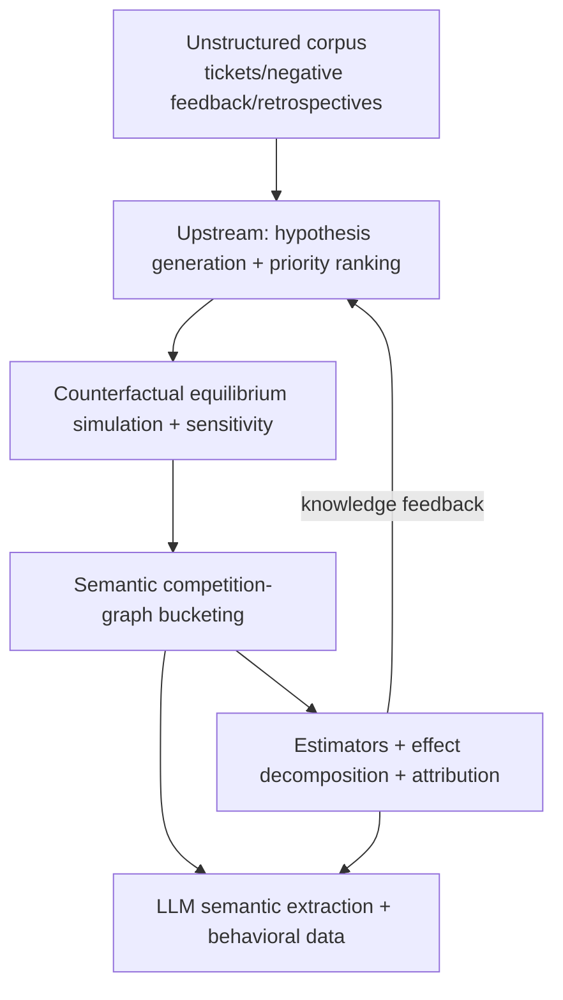

# SemAdExp: An LLM-Augmented Experimentation Intelligence Platform for Two-Sided Ad Markets


English | [中文](README.md)

An end-to-end, fully reproducible open-source project whose four layers are all quantitatively validated. Core thesis: **LLM semantic signals should run through the entire experimentation loop — hypothesis generation → counterfactual equilibrium simulation → semantic competition-graph bucketing → effect estimation → attribution & interference stripping → knowledge feedback — to make experiments in two-sided ad markets more accurate, more stable, and faster to iterate.**

## Key Evidence (current fixed-seed run; see `results/technical_report.md`)

| Challenge | Approach | Quantified evidence |
|---|---|---|
| Lagging / limited features | LLM semantic features fused with behavioral features | AUC 0.629 → 0.672 (+0.043), entropy gain +0.014 nats |
| Advertiser heterogeneity | Semantic competition-graph community bucketing | Cross-arm strong-edge ratio 0.525 → 0.255; worst-case bias −2.024 → −0.678, RMSE 2.098 → 0.864 |
| Measurement accuracy | Interference-aware estimators + effect decomposition | Randomization inference coverage 1.0 (conservative but calibrated); indirect-effect mean recovery error ≈ 0 |
| Iteration efficiency | LLM hypothesis generation + priority ranking | Top-8 opportunity recall 100%, Spearman ρ = +0.800, 50% value captured with 1 experiment (random baseline: 20) |
| Trial cost | Counterfactual equilibrium simulation | Ignoring advertiser responses misestimates total spend by ±5% and small-advertiser survival by +19%; sensitivity bands quantify risk |

## Architecture



## Quick Start

```bash
# 1. Create a virtualenv and install dependencies
python -m venv .venv
.venv/bin/pip install -r requirements.txt

# 2. One-shot verification (tests + notebook build + quick pipeline)
./scripts/verify.sh

# 3. Full pipeline (scenario matrix, knowledge base, equilibrium, closed loop, report)
.venv/bin/python -m semadexp.cli run-all --scale full
# Artifacts: results/technical_report.md, results/matrix_results.csv, results/figures/*

# 4. Run tests
.venv/bin/python -m pytest
```

## Documentation

- [Project overview](docs/project_overview.md) — positioning, problem mapping, quantified evidence, engineering highlights (Chinese)
- [15-minute demo guide](docs/demo_guide.md) — time allocation with matching notebooks (Chinese)
- [FAQ](docs/faq.md) — method trade-offs and data onboarding (Chinese)
- [Technical report](results/technical_report.md) — full method and result matrix (Chinese)
- [Project Wiki](https://github.com/geyuzi11/semadexp/wiki) — architecture, methodology, results & reproduction, data reference

## CLI Reference

```bash
# Build the semantic competition graph
.venv/bin/python -m semadexp.cli build-graph --n 110

# Compare bucketing policy design metrics
.venv/bin/python -m semadexp.cli bucket --policy graph_cluster

# Effect decomposition (direct / indirect)
.venv/bin/python -m semadexp.cli decompose

# Counterfactual equilibrium simulation (with sensitivity analysis)
.venv/bin/python -m semadexp.cli simulate-equilibrium --policy lower_bid_floor

# Hypothesis generation and quantified evaluation
.venv/bin/python -m semadexp.cli generate-hypotheses --n-experiments 60
.venv/bin/python -m semadexp.cli eval-hypotheses --n-experiments 60

# Scenario matrix
.venv/bin/python -m semadexp.cli batch --n 110 --days 8 --sessions 500 --reps 10
```

## Notebooks (5 Narrative Notebooks)

Sources live in `notebooks/src/` (directly executable); build Jupyter notebooks with:

```bash
.venv/bin/python scripts/build_notebooks.py
```

1. `01_simulator_and_ground_truth` — two-sided market simulator and ground-truth construction
2. `02_semantic_features_and_competition_graph` — LLM semantic features and competition graph
3. `03_bucketing_and_estimation` — bucketing policy comparison and effect estimation
4. `04_equilibrium_and_hypothesis_layer` — counterfactual equilibrium + quantified hypothesis evaluation
5. `05_closed_loop_demo` — full closed loop: hypothesis → simulation → bucketing → estimation → attribution

## Repository Layout

```text
semadexp/
  config.py             # pydantic configuration contracts
  llm/client.py         # OpenAI + deterministic offline dual backend, hash caching, cost log
  data/                 # corpus generation + sample data loader
  simulator/            # two-sided market simulator + counterfactual equilibrium
  features/             # semantic profiles + competition graph
  experiment/           # bucketing, estimators, CUPED, decomposition, attribution
  hypothesis/           # knowledge base, generation, ranking, evaluation, closed loop
  eval/matrix.py        # scenario matrix (interference × heterogeneity × bucketing × estimator)
  render.py             # Chinese technical report and chart rendering
  cli.py                # command-line entry point
notebooks/              # 5 narrative notebooks
tests/                  # automated test suite
results/                # run artifacts (report, CSVs, figures)
data/sample/            # ready-to-inspect sample data package
```

## Sample Data Package

`data/sample/` ships a fixed-seed sample generated without running the simulator, so you can inspect the input shapes immediately (~200 advertisers):

| File | Contents |
|---|---|
| `advertisers_sample.csv` | advertiser profiles (category / tier / budget / bid / quality / audience / creatives / objective) |
| `creative_corpus_sample.csv` | ad creative corpus (one row per creative) |
| `operation_logs_sample.csv` | advertiser operation logs (bid changes / creative swaps / targeting expansion, with free text) |
| `feedback_corpus_sample.csv` | multi-source feedback corpus (tickets / negative feedback / audits / retrospectives / industry news) |
| `behavior_sample.csv` | behavioral feature baseline with click labels (drop-in replacement: Criteo) |

Field-level documentation is in `data/sample/README.md`. Load everything with `semadexp.data.sample.load_sample()`; regenerate with `python scripts/export_sample_data.py`.

## LLM Access & Cost Control

- Set `OPENAI_API_KEY` and the system automatically uses `gpt-4o-mini` (structured tags / attribution / hypotheses) and `text-embedding-3-small` (semantic vectors); without a key, a deterministic offline backend runs the identical pipeline.
- All LLM outputs are cached by prompt hash under `data/cache/`; re-runs are fully offline. Costs are logged to `data/cache/llm_cost.csv` with a default $20 budget cap (raises stop the run).
- All random seeds are fixed; clearing artifacts and re-running yields identical results.

## Replacing with Public Data

The offline default uses a synthetic behavioral dataset so the repo runs out of the box. Drop Criteo into `data/criteo/train.txt` and call `semadexp/data/corpora.load_criteo_sample()` to plug in a real behavioral baseline.

## Honesty Statement (Limitations)

- Ad copy, operation logs, tickets, and retrospectives are controlled synthetic approximations; the knowledge-base ground truth comes from the simulator, not production.
- The auction and user models are simplified (first-price default, GSP configurable); production deployment requires real data and operational texts.
- The knowledge base size (60 experiments) and scenario matrix can be enlarged via `SCALE_DEFAULTS` for tighter confidence intervals.

## Extension Directions

- Onboard real ad texts and operation logs; control semantic extraction cost via caching/distillation.
- Extend to multi-slot auctions, bid optimization, and user interest drift.
- Make the knowledge feedback loop online: each experiment automatically updates the hypothesis library and the ranking model.

