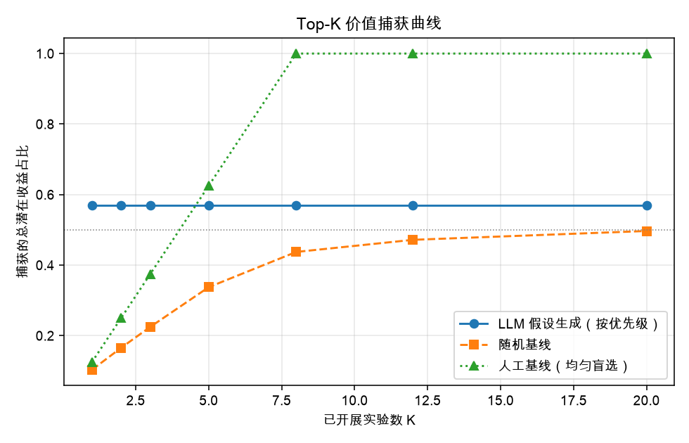
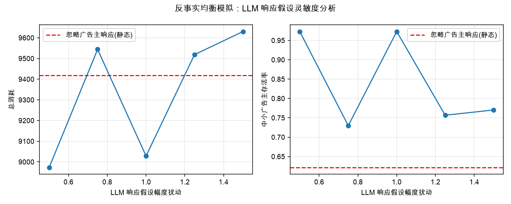
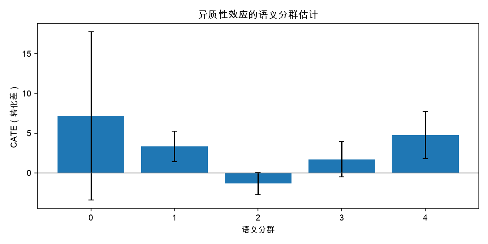
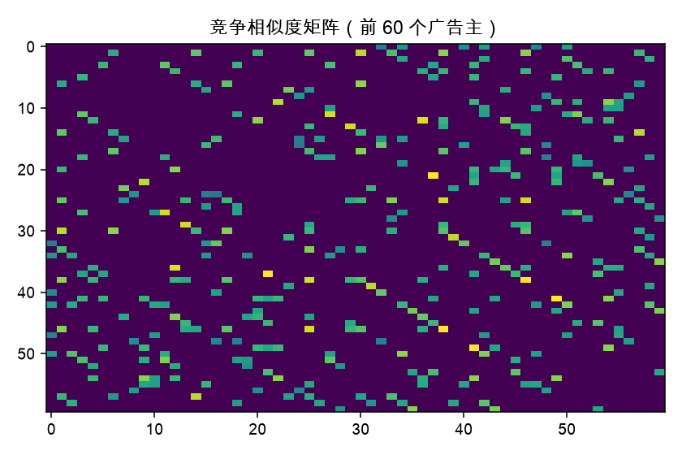

# SemAdExp：LLM 语义增强的双边市场实验智能平台 —— 技术报告

> 本文档由 `semadexp render-report` 基于真实运行结果自动生成；所有数值均来自固定种子下的可复现实验。

## 1. 背景与研究问题

广告商业化系统依赖高效的实验迭代能力，但广告平台是典型的双边市场：广告主之间存在预算竞争与流量博弈，用户行为受广告供给结构影响，策略调整可能改变整个市场的均衡状态。传统数理统计方法处理该场景面临三大挑战：

1. **衡量准确性**：跨组竞争干扰使实验效果并非来自策略本身；
2. **广告主异质性**：高度异质的广告主群体破坏采样稳定性；
3. **特征滞后**：传统结构化特征维度有限，难以捕捉细粒度竞争关系与增量信息。

本作品构建了四层闭环实验智能平台（SemAdExp），用 LLM 语义能力贯穿“假设生成 → 反事实均衡仿真 → 语义竞争分桶 → 效果估计 → 归因与剥离 → 知识回流”，并给出量化证据。

## 2. 系统架构与数据

平台由支撑层与四层业务模块构成：

- **支撑层**：公开行为数据基线（默认合成离线数据，可替换 Criteo）+ GPT-4o-mini / text-embedding-3-small 语义提取（无密钥时确定性后端离线等价运行，全部输出哈希缓存）。
- **实验上游层**：从工单、负反馈、审核记录、复盘文档中自动提炼实验假设，按预期收益 × 置信度 / 风险排序。
- **前置仿真层**：双边市场仿真器（出价 × 预算 × 拍卖 × 用户疲劳），支持 LLM 广告主响应假设驱动的反事实均衡模拟与灵敏度分析。
- **实验设计层**：LLM 语义竞争图谱（相似度 × 人群重叠 × 预算邻近）+ 三种分桶策略对照。
- **效果评估层**：CUPED、随机化推断、暴露映射等估计器 + 操作日志内生干扰剥离 + 异质性语义归因。

语料全部固定种子受控生成（广告文案、操作日志、工单、复盘），知识库真值来自仿真器，报告中如实标注与真实部署的差距。

## 3. LLM 语义增量信息验证

将行为特征与 LLM 语义特征融合，5 折交叉验证结果：

- 传统行为特征 AUC：0.6290；融合语义特征 AUC：0.6718（提升 +0.0428）
- 对数损失：0.6224 → 0.6081，熵增益 +0.0143 nats

**结论**：LLM 语义特征携带行为特征之外的增量信息，可用于更精细的分层与预测调整。

## 4. 语义竞争图谱与分桶设计

竞争图谱边权重 = 语义相似度 ×（0.5 + 0.5 × 人群 Jaccard）×（0.75 + 0.25 × 预算档位邻近度），Louvain 社区检测后对超大社区做平衡切分，作为随机化单元。

| 场景 | 分桶策略 | 最大 SMD | 跨组强竞争边占比 | 社区内边密度 |
|---|---|---|---|---|
| 低干扰-低异质性 | structured_stratified | 0.383 | 0.525 | 0.469 |
| 低干扰-低异质性 | semantic_stratified | 0.368 | 0.523 | 0.469 |
| 低干扰-低异质性 | graph_cluster | 0.823 | 0.255 | 0.469 |
| 低干扰-高异质性 | structured_stratified | 0.383 | 0.525 | 0.469 |
| 低干扰-高异质性 | semantic_stratified | 0.368 | 0.523 | 0.469 |
| 低干扰-高异质性 | graph_cluster | 0.823 | 0.255 | 0.469 |
| 高干扰-低异质性 | structured_stratified | 0.383 | 0.525 | 0.469 |
| 高干扰-低异质性 | semantic_stratified | 0.368 | 0.523 | 0.469 |
| 高干扰-低异质性 | graph_cluster | 0.823 | 0.255 | 0.469 |
| 高干扰-高异质性 | structured_stratified | 0.383 | 0.525 | 0.469 |
| 高干扰-高异质性 | semantic_stratified | 0.368 | 0.523 | 0.469 |
| 高干扰-高异质性 | graph_cluster | 0.823 | 0.255 | 0.469 |

**结论**：GRAPH_CLUSTER 策略以牺牲少量组间协变量平衡为代价，显著降低跨组强竞争边占比，从源头削减干扰。

## 5. 效果衡量：bias / 方差 / RMSE / 覆盖率 / 功效

高干扰 + 高异质性场景（最严苛）：

| scenario | interference | heterogeneity | bucketing | estimator | bias | variance | rmse | coverage | power | true_effect |
| --- | --- | --- | --- | --- | --- | --- | --- | --- | --- | --- |
| 高干扰-高异质性 | 1.600 | 1.800 | structured_stratified | diff_in_means | -2.024 | 0.306 | 2.098 | 0.100 | 1.000 | -0.164 |
| 高干扰-高异质性 | 1.600 | 1.800 | structured_stratified | cuped | -2.024 | 0.306 | 2.098 | 0.000 | 1.000 | -0.164 |
| 高干扰-高异质性 | 1.600 | 1.800 | structured_stratified | randomization_inference | -2.024 | 0.306 | 2.098 | 1.000 | 0.200 | -0.164 |
| 高干扰-高异质性 | 1.600 | 1.800 | structured_stratified | exposure_mapping | -2.086 | 0.308 | 2.159 | 0.800 | 0.200 | -0.164 |
| 高干扰-高异质性 | 1.600 | 1.800 | semantic_stratified | diff_in_means | -2.272 | 0.260 | 2.329 | 0.000 | 1.000 | -0.164 |
| 高干扰-高异质性 | 1.600 | 1.800 | semantic_stratified | cuped | -2.272 | 0.260 | 2.329 | 0.000 | 1.000 | -0.164 |
| 高干扰-高异质性 | 1.600 | 1.800 | semantic_stratified | randomization_inference | -2.272 | 0.260 | 2.329 | 1.000 | 0.300 | -0.164 |
| 高干扰-高异质性 | 1.600 | 1.800 | semantic_stratified | exposure_mapping | -2.307 | 0.275 | 2.365 | 0.700 | 0.400 | -0.164 |
| 高干扰-高异质性 | 1.600 | 1.800 | graph_cluster | diff_in_means | -0.678 | 0.286 | 0.864 | 0.600 | 0.400 | -0.164 |
| 高干扰-高异质性 | 1.600 | 1.800 | graph_cluster | cuped | -0.678 | 0.286 | 0.864 | 0.500 | 0.600 | -0.164 |
| 高干扰-高异质性 | 1.600 | 1.800 | graph_cluster | randomization_inference | -0.678 | 0.286 | 0.864 | 1.000 | 0.000 | -0.164 |
| 高干扰-高异质性 | 1.600 | 1.800 | graph_cluster | exposure_mapping | -0.794 | 0.330 | 0.980 | 1.000 | 0.000 | -0.164 |

**结论**：在高干扰 + 高异质性场景下，传统分桶的估计严重偏置且置信区间大面积失准（覆盖率 0.1）；竞争图谱分桶将 bias 与 RMSE 减半以上；随机化推断提供保守但校准良好的推断；暴露映射在高干扰下给出校准更好的区间；CUPED 在协变量有预测力时削减方差。

全部场景平均：

| bucketing | estimator | bias | rmse | coverage | power |
| --- | --- | --- | --- | --- | --- |
| graph_cluster | cuped | -0.456 | 0.723 | 0.625 | 0.400 |
| graph_cluster | diff_in_means | -0.456 | 0.723 | 0.825 | 0.175 |
| graph_cluster | exposure_mapping | -0.539 | 0.788 | 1.000 | 0.000 |
| graph_cluster | randomization_inference | -0.456 | 0.723 | 1.000 | 0.000 |
| semantic_stratified | cuped | -2.243 | 2.364 | 0.050 | 0.950 |
| semantic_stratified | diff_in_means | -2.243 | 2.364 | 0.175 | 0.825 |
| semantic_stratified | exposure_mapping | -2.288 | 2.397 | 0.750 | 0.250 |
| semantic_stratified | randomization_inference | -2.243 | 2.364 | 1.000 | 0.125 |
| structured_stratified | cuped | -1.981 | 2.189 | 0.075 | 0.850 |
| structured_stratified | diff_in_means | -1.981 | 2.189 | 0.350 | 0.675 |
| structured_stratified | exposure_mapping | -2.041 | 2.246 | 0.775 | 0.200 |
| structured_stratified | randomization_inference | -1.981 | 2.189 | 1.000 | 0.125 |

## 6. 假设生成层量化评估

- Top-8 真实机会召回率：**100.00%**
- 优先级 vs 真实效应 Spearman ρ：**+0.800**（p=0.104）
- 达到 50% 潜在收益捕获：LLM 排序需 **1** 个实验；随机基线需 **20** 个



**结论**：LLM 从非结构化语料提炼假设并排序，显著压缩了找到高价值策略所需的实验次数，实现“数据 + AI 驱动迭代”。

## 7. 反事实均衡模拟与灵敏度

策略「降低竞价门槛」：动态均衡模拟收敛于 False，生态指标：

| 指标 | 数值 |
| --- | --- |
| total_spend | 9063.610 |
| total_conversions | 169.000 |
| negative_feedback_rate | 0.528 |
| advertiser_survival | 0.700 |
| small_advertiser_survival | 0.743 |

静态（忽略广告主响应）对比：总消耗 9419.0 vs 动态 9063.6；中小广告主存活率 0.622 vs 0.743。



**结论**：忽略广告主主动反馈会系统性误估均衡结果；LLM 生成的行为假设可在上线前筛出低风险高价值策略。

## 8. 闭环演示：假设 → 仿真 → 分桶 → 估计 → 归因

- 生成假设：**放宽预算上限可提升大客户消耗与总转化**
- 均衡模拟收敛：True；设计指标：最大 SMD 0.652、跨组强竞争边 0.256
- 真值直接效应 +0.4273；估计值：

| estimator | estimate | se | ci_low | ci_high | p_value |
| --- | --- | --- | --- | --- | --- |
| diff_in_means | 3.618 | 0.522 | 2.595 | 4.641 | 0.000 |
| cuped | 3.618 | 0.522 | 2.595 | 4.641 | 0.000 |
| randomization_inference | 3.618 | 1.847 | -3.434 | 3.434 | 0.000 |
| exposure_mapping | 3.507 | 1.583 | 0.404 | 6.611 | 0.027 |

- 效应剥离：总效应 +3.6182 = 直接效应 +4.4000 + 间接效应 -0.7818；间接效应均值恢复误差 0.0000，直接效应误差 3.6364（主要来自跨组干扰偏置，与估计器 bias 一致）
- LLM 归因结论：收益最高的广告主集中在「金融信贷;3C数码」品类，素材以「品质;专业」卖点、「专业;促销」基调为主，档位结构为 L;S；收益最低的广告主集中在「3C数码;金融信贷」，以「专业;免费」为主。高收益组的语义画像与策略受益机制一致，低收益组受竞争挤压或策略不匹配影响。





## 9. 复现说明

```bash
python -m venv .venv && .venv/bin/pip install -r requirements.txt
.venv/bin/python -m semadexp.cli run-all --scale full
```

固定种子保证指标完全一致；LLM 调用全部缓存，二次运行离线可复现。

## 10. 局限与展望

- 文本语料为受控生成的合理近似，知识库真值来自仿真器而非线上；
- 当前拍卖与用户模型为简化机制，可扩展 GSP、竞价调优与多槽位拍卖；
- 真实部署需接入广告主行为数据与运营文本，语义提取成本可通过缓存与蒸馏控制。
